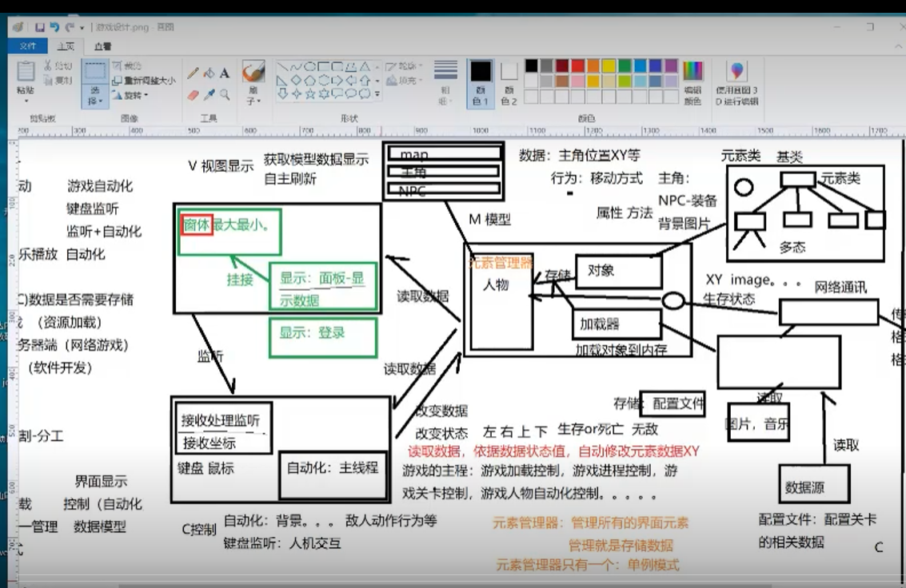
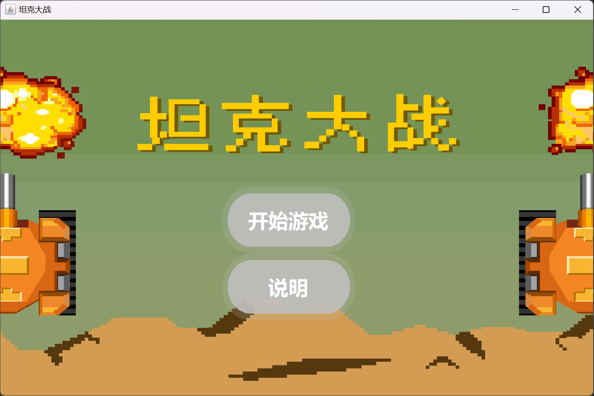
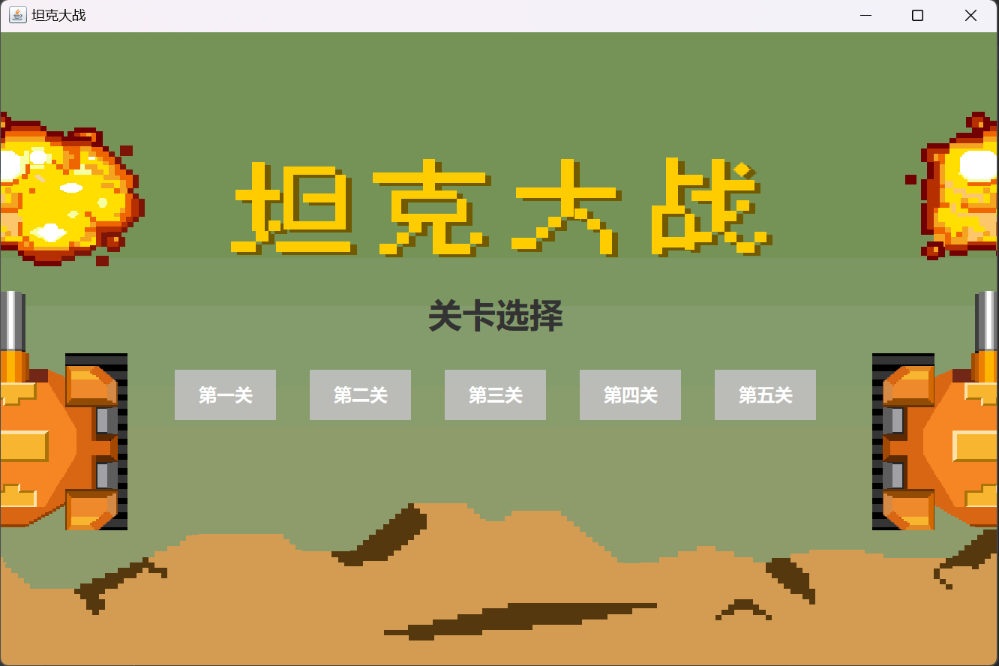
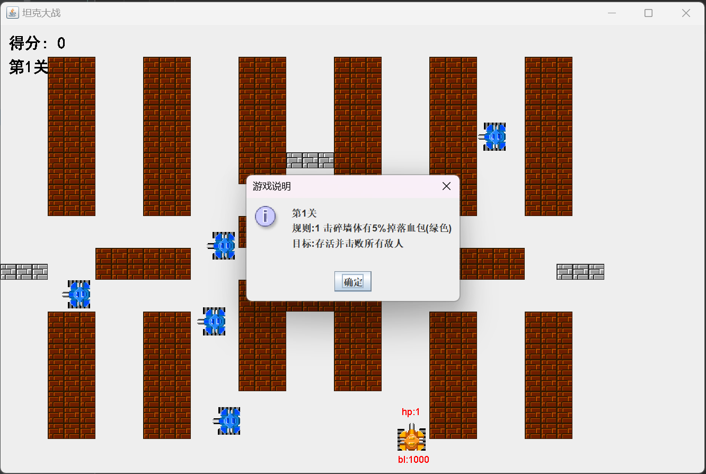
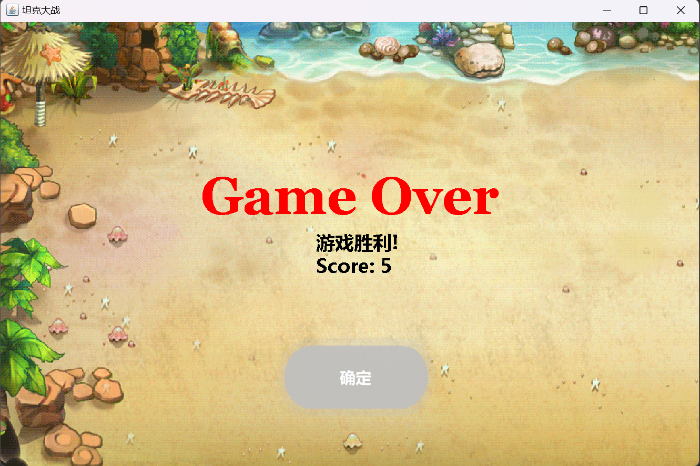
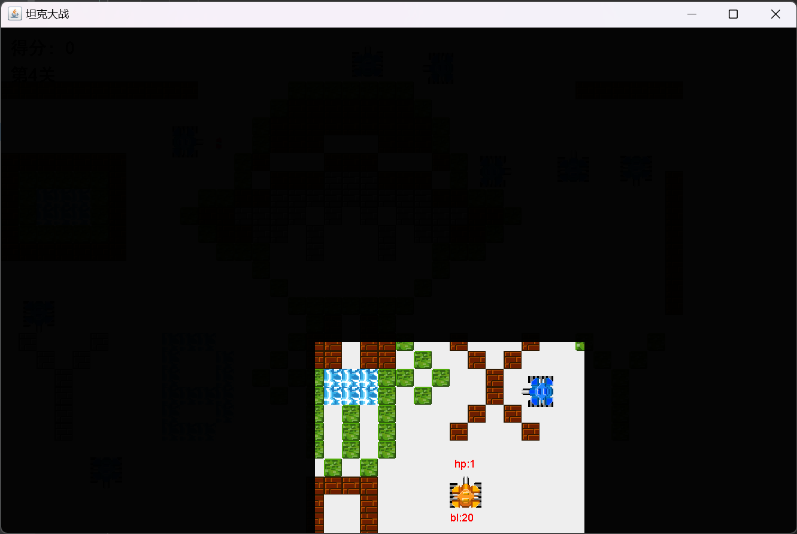
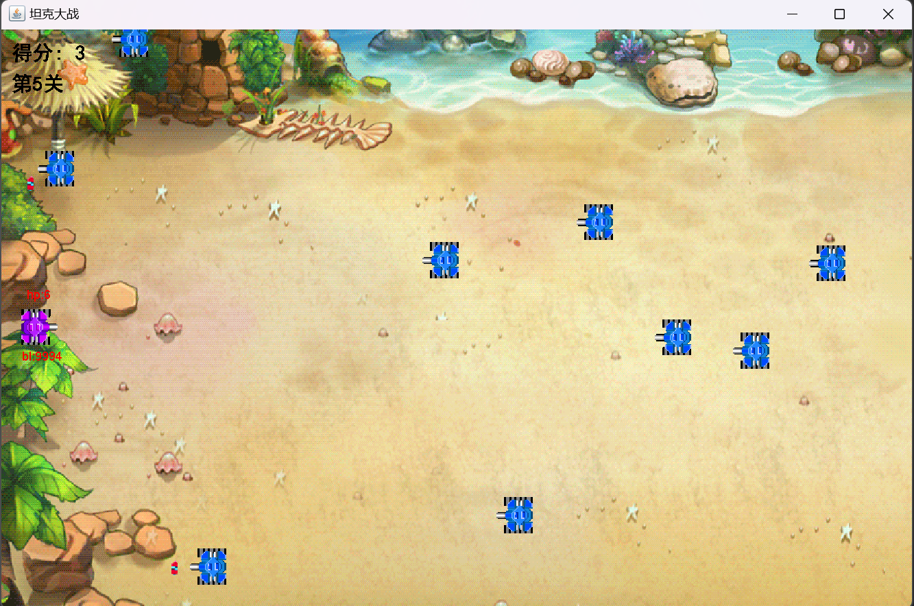

# 初级实作项目

  ---


## 背景介绍

在遥远的未来，地球资源枯竭，人类为了生存，不得不踏上星际征途。宇宙中的一个行星系，被发现拥有丰富的资源和无穷的能源。然而，这个行星系并不是无人居住的乐土，那里存在着凶猛的敌对势力。各大势力为了争夺资源，纷纷组建了强大的装甲部队，展开了激烈的坦克大战。

在这场战争中，玩家扮演一名精英坦克指挥官，带领自己的坦克队伍，在战火纷飞的战场上，与敌人展开殊死搏斗。战场上不仅有险恶的地形和严酷的天气，更有来自敌方坦克的致命攻击。玩家需要灵活运用战略，合理指挥部队，避开敌人的炮火，同时精准地摧毁敌人的坦克。

在这场坦克大战中，智慧与勇气是胜利的关键。只有最强的指挥官，才能在这片战火硝烟中脱颖而出，成为真正的王者。准备好了吗？拿起你的武器，驾驶你的坦克，踏上这场壮丽的征途吧！


---


## 概要设计

MVC（Model-View-Controller）框架是一种设计模式，用于分离应用程序的内部表示、用户接口和控制逻辑。它主要由三个组件构成：模型（Model）、视图（View）和控制器（Controller）。在游戏开发中，MVC框架可以有效地组织代码结构，提升代码的可维护性和扩展性。

### MVC框架概述

#### 1. 模型（Model）

模型代表应用程序的数据和业务逻辑。它负责数据的存储、处理和业务规则的实现。在游戏中，模型通常包括游戏状态、玩家信息、敌人状态、游戏物理等。

#### 2. 视图（View）

视图负责显示数据和用户界面。它从模型中获取数据，并将这些数据展示给用户。在游戏中，视图包括游戏的图形界面、动画、音效等。

#### 3. 控制器（Controller）

控制器是视图和模型之间的中介，它接收用户输入并调用模型和视图来完成用户请求。在游戏中，控制器处理玩家的输入（如键盘、鼠标事件），并根据输入更新模型和视图。


### 游戏架构图




```  
src  
└── com.tedu  
    ├── controller
    │   ├── GameListener    
    │   └── GameThread    
    ├── element    
    │   ├── ElementObj    
    │   ├── MapObj   
    │   ├── Player    
    │   ├── Enemy   
    │   ├── Bullet   
    │   ├── Item
    │   ├── Laser         
    │   └── Mask
    ├── game    
    │   └── GameStart    
    ├── manager    
    │   ├── ElementManager    
    │   ├── GameElement    
    │   └── GameLoad    
    ├── show    
    │   ├── GameJFrame 
    │   ├── GameMainJPanel 
    │   ├── StartJPanel
    │   ├── LevelSelectJPanel
    │   └── OverJPanel    
    ├── text    
    │   ├── 1.map    
    │   ├── 2.map    
    │   ├── 3.map    
    │   ├── 4.map     
    │   ├── GameData.pro     
    │   ├── MAV.pro  
    │   └── obj.pro  
```

---

## 详情介绍
### 游戏元素
#### 玩家
##### 1 属性
速度 1
生命值 6/2/1
弹药 1000/30

##### 2 操作
移动: 上左下右 WASD
射击: 空格 SPACE
退出游戏: ESC


#### 敌人
每个单位时间(每秒约60个)

##### 属性
速度 2

0.4%几率发射子弹/每单位时间

紧急模式(见下方难点)

#### 子弹
##### 属性
速度 3

#### 墙体

##### 1 砖块
击碎需要 一发子弹

不可跨越(所有物体)

##### 2 铁块
击碎需要 四发子弹

不可跨越(所有物体)

##### 3 河流
击碎需要 ∞

不可跨越(除子弹)

##### 4 草地
击碎需要 ∞

可跨越(所有物体)

#### 道具

##### 1 血包
绿色方块

拾取后 生命值hp+1

##### 2 弹药
橙色方块

拾取后 弹药数bl+5


### 游戏任务

#### 关卡1-4
消灭所有敌人

#### 关卡5
得分100


---


## 技术难点

### 碰撞检测

传统意义上实现的碰撞检测都是先运动再检测回调位置

使用这样的方式有些难以适应

解决方案：

即将修改坐标以移动时，将未来要移动到的坐标进行检测是否碰撞

若碰撞则取消修改坐标，反之

### `ConcurrentModificationException` 异常

在这次项目中出现最多的错误

通常是因为
在迭代一个集合（如 `ArrayList`）时修改了它

如
在主面板的 `paint` 方法中直接遍历并修改了 `ElementManager` 中的集合，导致在 `repaint` 时发生并发修改异常

解决方案：

1 使用迭代器的 `remove` 方法
2 使用并发集合如 `CopyOnWriteArrayList`
3 创建集合的副本

由于 `CopyOnWriteArrayList` 在写操作时会创建一个新的内部数组，它可以保证线程安全，但代价是写操作的性能开销较大。

最终使用了更加简洁实现的方案3

### 主线程逻辑

如何更好的实现关卡切换功能

在课上的基础讲解中给出的方案是

```Java
@Override  
public void run() {  
	while(true){
	    //游戏开始前  
	    gameLoad();  
	    //游戏进行时  
	    gameRun();  
	    //游戏场景结束  
	    gameOver(); 
    } 
}
```

如此进行无限循环进行关卡实在是不够方便

解决方案：

我的做法是将while循环拆开，给GameThread命名一个 public static的关卡状态变量

每一关运行都修改这个变量来区分关卡

### 智能化敌人

游戏里的敌人都太"笨"了

如何用更好的算法来造出更强大的敌人

方法有很多，比如如果能将地图简化之类，给敌人做一个寻路算法和控制

但是实在没有时间精力做很多

解决方案：

1 敌人随机移动

2 敌人躲避子弹

在发现有玩家子弹且距离较近时，进入紧急模式
- 往垂直方向运动以尝试躲避
- 进入100个单位时间的争用期(这段时间内只会往某一垂直方向持续运动)
- 发射子弹几率提高4倍


---

## 效果展示









---


## 实验环境

### IDE


- Eclipse IDE for Java Developers (includes Incubating components)
  Version: 2023-09 (4.29.0)
- IntelliJ IDEA 2023.3.2 (Community Edition)
- IntelliJ IDEA 2022.2.3 (Ultimate Edition)


### JDK

- jdk17     (17.0.9+7-b1087.9 amd64)
- jdk8


## 署名

22软工 lxx hjl lzg lyl ljr